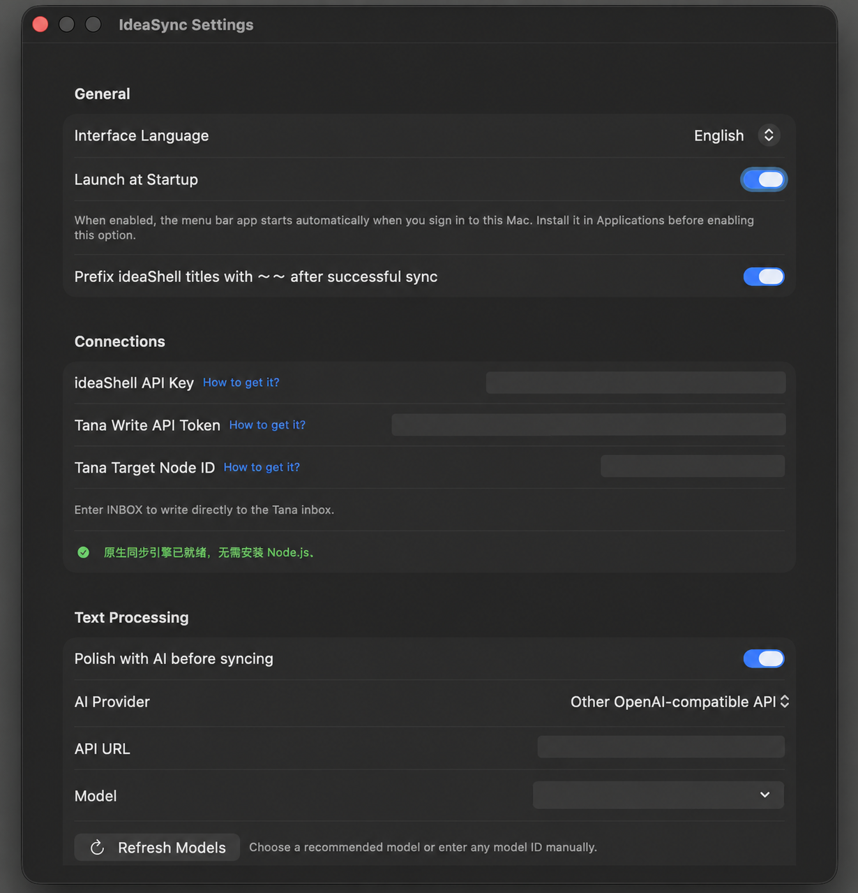

# IdeaSync

[中文](README.md)

**IdeaSync** (闪念同步) automatically sends new notes from ideaShell to a Tana node you choose.

It is a native macOS menu-bar app: no Node.js, no Terminal, and no relay server. After you enter your own credentials, everything runs locally on your Mac.

[Download the latest stable release](https://github.com/jiangsir-tech/ideashell-tana-sync/releases/latest) · macOS 14+ · Apple-signed and notarized · Universal for Apple Silicon and Intel


## What it does

- **Syncs notes into Tana automatically:** sync manually, on a 5, 10, 15, 30, or 60-minute schedule, or once each day.
- **Avoids partial and duplicate imports:** waits for transcriptions and note text to settle, then records synced items locally.
- **Keeps the source state clear:** adds the `～～` marker to the original ideaShell note only after Tana confirms the write.
- **Optional AI polishing:** supports OpenAI, DeepSeek, OpenRouter, Anthropic Claude, Google Gemini, Ollama, and other OpenAI-compatible endpoints.
- **Shows useful history:** view all-time, monthly, and 30-day discovered-versus-synced trends. History stores counts only, never note content.
- **Chinese and English UI:** follows macOS or switches language instantly in Settings.


## Install in three steps

1. Download `IdeaSync-*.dmg` from the [Releases page](https://github.com/jiangsir-tech/ideashell-tana-sync/releases/latest).
2. Open the DMG and drag **IdeaSync** to **Applications**.
3. Open it from the menu bar, choose **Settings**, and enter your ideaShell API key, Tana Write API token, and destination node ID.

The stable release is Apple-signed and notarized, so it opens normally. Use `INBOX` as the destination node ID to write to your Tana Inbox.

## What you need

- macOS 14 or later
- An ideaShell MCP API key
- A Tana Write API token
- A Tana destination node ID (or `INBOX`)
- Optional: an AI provider API key for polishing notes before sync

## Settings at a glance

Settings brings together language, launch at startup, ideaShell and Tana connections, and optional AI polishing. Most settings save automatically; the polishing prompt has its own **Save Prompt** button. Sensitive values in the screenshot are irreversibly redacted.



## How syncing works

```text
New ideaShell note → wait for stable content → write succeeds in Tana → mark the source note
```

New notes pass two stability checks and wait for at least four minutes. A pending item normally means a voice transcription or its text is still settling. New voice notes usually arrive in Tana within 5–10 minutes.

For automatic sync, your Mac only needs to be on and signed in. ideaShell, Tana, and Terminal do not need to stay open.

## Privacy and security

- Credentials, sync state, and logs stay on your Mac at `~/Library/Application Support/ideashell-tana-sync/`.
- There is no cloud account, database, or relay server.
- When AI polishing is enabled, note text is sent directly to the AI provider you configured. It is not sent when polishing is off.
- Sync history stores dates and counts, never note content.

## FAQ

**Do I need Node.js?**

No. The sync engine is built into the app.

**How do I update?**

Choose **Check for Updates** from the About window. If an update is available, IdeaSync opens its GitHub Release page.

**Where can I send feedback?**

Choose **Feedback** in the About window, or use the [feedback form](https://tally.so/r/2EyvKg). Please remove API keys, tokens, and note text before sending a report.

## License

[MIT](LICENSE)
