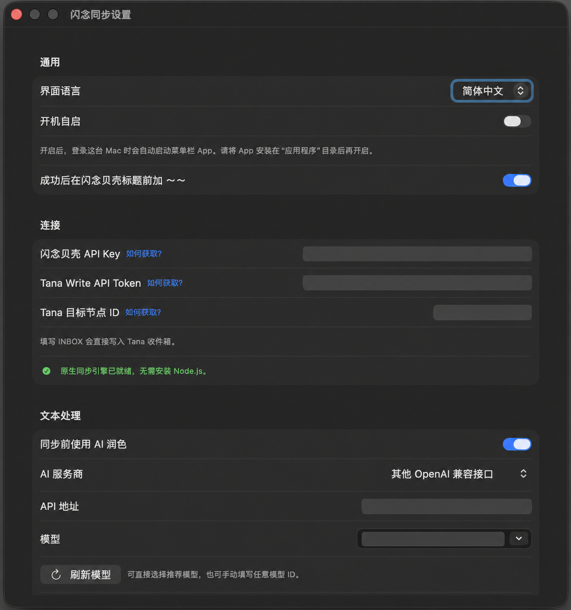

# 闪念同步 · IdeaSync

[English](README.en.md)

把闪念贝壳（ideaShell）里新产生的笔记，自动同步到你指定的 Tana 节点。

这是一个原生 macOS 菜单栏 App：不需要 Node.js、不需要终端，也不经过第三方中转服务器。填好自己的凭证后，它会在你的 Mac 本机运行。

[下载最新正式版](https://github.com/jiangsir-tech/ideashell-tana-sync/releases/latest) · macOS 14+ · Apple 签名与公证 · Apple Silicon 与 Intel 通用


## 它能做什么

- **自动把闪念写进 Tana**：支持手动同步，或每 5、10、15、30、60 分钟及每日定时自动同步。
- **避免半截内容和重复导入**：语音转录或正文稳定后再写入；本机记录已同步项目，避免重复。
- **保留清晰的来源状态**：仅在 Tana 成功写入后，才会为闪念贝壳原笔记添加 `～～` 标记。
- **可选 AI 润色**：支持 OpenAI、DeepSeek、OpenRouter、Anthropic Claude、Google Gemini、Ollama，以及其他 OpenAI 兼容接口。
- **同步历史一目了然**：查看累计、本月与最近 30 天的新增和已同步趋势；历史只保存统计数字，不保存笔记正文。
- **中英文界面**：跟随系统语言，也可在设置中随时切换简体中文或 English。


## 安装只要三步

1. 在[发布页](https://github.com/jiangsir-tech/ideashell-tana-sync/releases/latest)下载 `IdeaSync-*.dmg`。
2. 打开 DMG，将“闪念同步”拖进“应用程序”文件夹。
3. 从菜单栏打开 App，进入“设置”，填入闪念贝壳 API Key、Tana Write API Token 与目标节点 ID。

正式版已完成 Apple 签名和公证，可以直接打开。填写 `INBOX` 作为目标节点 ID，会写入 Tana 收件箱。

## 你需要准备

- macOS 14 或更新版本
- 闪念贝壳 MCP API Key
- Tana Write API Token
- Tana 目标节点 ID（或填写 `INBOX`）
- 可选：任一 AI 服务的 API Key，用于同步前润色文本

## 配置一览

设置页集中管理语言、开机启动、闪念贝壳与 Tana 连接，以及可选的 AI 润色。普通设置会自动保存；润色提示词需要手动点击“保存提示词”。下图中的敏感值已做不可逆遮挡。



## 同步如何运行

```text
闪念贝壳新笔记 → 等待内容稳定 → 写入 Tana 成功 → 标记闪念贝壳原笔记
```

首次发现的笔记会经过两次稳定性检查，并至少等待约 4 分钟；因此“处理中”通常表示它正在等待语音转录或内容完成。新语音笔记一般会在 5～10 分钟内同步完成。

自动同步只要求 Mac 开机并已登录；不需要一直打开闪念贝壳、Tana 或终端。

## 隐私与安全

- 凭证、同步状态与日志只保存在你的 Mac：`~/Library/Application Support/ideashell-tana-sync/`。
- 项目没有云端账号、数据库或中转服务器。
- 启用 AI 润色时，笔记正文会直接发送给你在设置中选择的 AI 服务；未启用时不会发送。
- 同步历史只保存日期和数量，不保存笔记正文。

## 常见问题

**需要安装 Node.js 吗？**

不需要。同步引擎已内置在 App 中。

**如何更新？**

在“关于”窗口点击“检查更新”，发现新版后会打开对应的 GitHub 发布页。

**可以反馈问题或建议吗？**

可以。App 的“关于”窗口提供“反馈与建议”入口，也可以直接打开[反馈表](https://tally.so/r/2EyvKg)。反馈前请移除 API Key、Token 和笔记正文等私人信息。

## License

[MIT](LICENSE)
